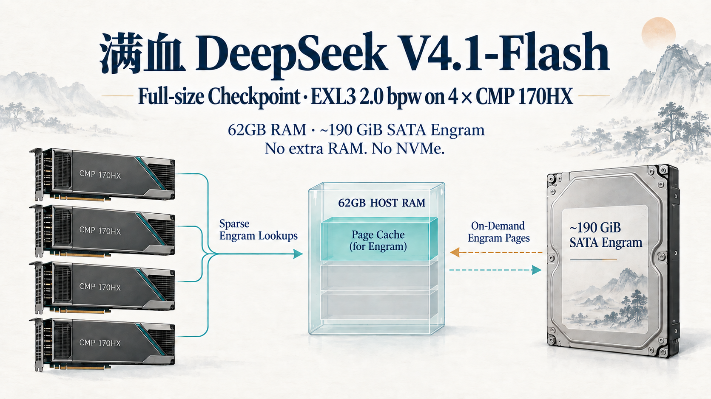
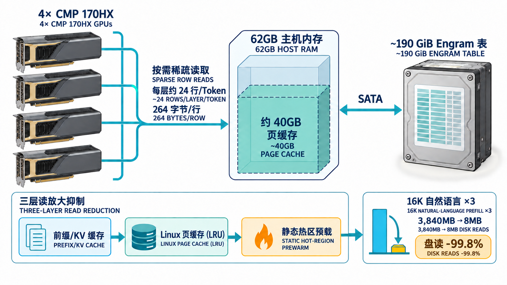

# 1. 把满血 DeepSeek V4.1-Flash 跑在 4× CMP 170HX 上,不加内存不加盘

一周多前的凌晨一点,health check 返回 200 的时候我盯着屏幕愣了几秒。之后这一周多,一直在用它跑实际负载、调优、踩坑。

32K 稳态 prefill 达到 1,821 tok/s；1M-token prompt 在本机实测通过。DSH Agent 场景的输出速度为 11.2–11.6 tok/s（这是完整 Agent 任务口径，不等同于下文的 decode-only benchmark）。系统用 4 张 CMP 170HX、62GB 主机内存和一块 SATA 盘，跑的是完整 V4.1-Flash 部署组件包。

**先说明“满血 / full-size”的参数口径：** DeepSeek 官方报告的是 552B backbone + 196B Engram；完整本地推理组件还包括约 14B 的 DSpark 草稿器和约 0.5B 的视觉编码器，因此按这些已取整组件相加约 762.5B，简写约 763B。这不是 DeepSeek 官方单一的“总参数”标称值。原稿里的“764B”是混用不同清单和取整口径的粗略写法，为免误导，本文统一按约 763B 描述。这里的“满血”指没有换成蒸馏小模型、保留完整组件；**不代表原精度权重**：本部署包只把 routed experts 做 EXL3 2.0 bpw MCG 量化，其他张量保留来源 dtype，Engram 以 FP8 保留并放在 SSD 上按需读取。

| 组件 | 约参数量 | 口径 |
|---|---:|---|
| Backbone | 552B | DeepSeek 官方报告值 |
| Engram 检索表 | 196B | 官方报告的条件记忆参数量；两张大表合计约 189 GiB 存储 |
| DSpark 草稿器 | 约 14B | 独立的多 token 草稿模块，不计入官方 552B backbone |
| 视觉编码器 | 约 0.5B | 按公开模型配置 / 权重清单估算 |
| 完整部署组件合计 | 约 762.5B，简写约 763B | 由上列近似值相加；不是单独的官方标称口径 |

参数来源：[DeepSeek 技术报告与模型卡](https://huggingface.co/deepseek-ai/DeepSeek-V4.1-Flash)、[公开模型配置](https://huggingface.co/deepseek-ai/DeepSeek-V4.1-Flash/raw/main/config.json)、[vLLM 对 DSpark 组件的说明](https://recipes.vllm.ai/deepseek-ai/DeepSeek-V4.1-Flash)、[EXL3 权重包的量化范围与来源 dtype 说明](https://huggingface.co/sfxnz/DeepSeek-V4.1-Flash-EXL3)。

没有 NVMe。没有加内存条。没有换主板。

为什么要做这件事？说实话，输出效率不会高——完整组件约 763B，但这不意味着所有参数都塞进 62GB 主机内存：backbone / 专家分布在 GPU，约 189GiB 的 Engram 表放在 SATA 上按需读取。性能会受 GPU、SATA 随机读和缓存共同约束。这不是一个追求峰值性能的项目。

我真正想知道的是：**在硬件严重受限的条件下，有哪些优化思路可以撑起一个"不可能"的部署？** 约 189GiB 的检索表能不能当数据库用而不是整张加载？62GB 内存里的页缓存能不能扛住一个约 189GiB 表的查询压力？SATA 的随机读够不够支撑这个完整组件包里的 Engram 查表？

为回答这些问题，部署中最关键的机制可以概括为下图：

*图：Engram 表保留在 SATA 上并按需读取；62GB 主机内存中约 40GB 可由 Linux 页缓存使用。特定自然语言 16K×3 预填充测试的盘读从 3,840MB 降至 8MB（-99.8%），这是该测试集的实测结果，不代表所有提示词。 / Figure: The Engram table stays on SATA and is read on demand; about 40GB of host memory is available to Linux page cache. In one specific 3×16K natural-language prefill test, disk reads fell from 3,840MB to 8MB (-99.8%); this result is workload-specific.*

在我对比的几条公开路线里，有的依赖约 373GB 主机内存，有的使用 NVMe；这篇记录的是另一种硬件约束下的实测尝试，并不声称此前没有类似 SSD-Engram 工作。我把过程和踩过的坑写出来，希望能给做类似优化的人多一些参考。

假期抽空把整个测试报告整理了出来，以下是完整数据。

# 2. 为什么我尝试把 Engram 放到 SSD

V4.1-Flash 的 Engram 是挂在第 1 和第 14 层的两组大型 n-gram hash embedding 表，权重清单中合计约 189GiB（约 203GB 十进制；两片各约 94.5GiB）。它不是普通 MoE routed-expert 权重；当前 EXL3 包只量化 routed experts，Engram 仍保留来源 FP8 dtype，因此本方案不量化它，而是让它留在磁盘按需读取。kaka86mm 跑通了 4× 170HX，采用 373GB 级别的主机内存把表驻留；Mia 的双 DGX Spark 使用 NVMe packing。

我的机器：62GB 主机内存，SATA 随机读约 50MB/s。Engram 文件约为主机内存的 3 倍。

它本质上是查找表，不必把整个表常驻内存。配置包含两个 Engram 层（第 1、14 层）；每层有 8 个 hash head、覆盖 2/3/4-gram，理论上每 token 最多约 24 个候选行查找。当前 row-store 路径中单行约 264B；这只是逻辑行数据量，实际磁盘读取还受页粒度、缓存命中和并发影响。

# 3. 主流方案对比与思路来源

在定方案之前,我把社区已有的几条路线过了一遍:

**路线 A：[kaka86mm 的 373GB 内存钉表方案](https://github.com/kaka86mm/dsv41-flash-pp4-170hx)。** 同款 4× 170HX，公开记录质量测试 7/7，速度最稳；其配置需要约 373GB 主机 RAM（约 189GiB Engram 加运行余量），我的机器只有 62GB。参考价值：证明了 170HX 能跑 EXL3 2bpw，benchmark 套件可参考复用。

**路线 B：[Mia 双 DGX Spark 的 NVMe packing 方案](https://github.com/MiaAI-Lab/DeepSeek-v4.1-Flash-EXL3-2x-DGX-Sparks)。** Engram 按节点拆成约 94GiB 放到 NVMe，用 `posix_fadvise` 预热。核心洞察：**Engram 是查找表，不必完整加载，可按需 `pread`**。其公开配置使用 NVMe；其吞吐数据与我的 SATA 实测不是同一机器、同一测试条件，以下只作方案背景，不当作严格硬件对照。

**路线 C：[zebgop-ops 的 SSD-Engram overlay](https://github.com/zebgop-ops/dsv41reap-pp)。** 仓库实现了 `DSV41_ENGRAM_STORAGE=ssd` 模式：GPU 算哈希 → CUDA 宿主回调 → 线程池 `pread` 读取 safetensors → 页缓存 → 设备端反量化。其测试机器为 123GB RAM + NVMe。

**路线 D：硬件改造。** 例如 PCIe 链路改造或更换 EPYC 平台；具体焊接和成本依设备而异。它可能改善卡间带宽，但不解决 Engram 表的存储容量问题，因此本次没有采用。

我的方案 = **路线 B 的核心思想（Engram 按需查表，不整表载入）+ 路线 C 的现成实现（SSD 模式开关）+ 路线 A 的权重包和 benchmark**。初始假设是：62GB 内存中腾出约 40GB 给页缓存，重复访问的行能受益于 LRU；实际命中率取决于访问分布，需要按真实 row-store 统计验证，不能仅凭 Zipf 分布推断“文件头就是热区”。

# 4. 实际部署(9月18日晚间)

权重下载和 docker 镜像拉取都是体力活——换镜像源、调并发、等断点续传，不展开。真正有技术含量的是两件事：**首启四关**和**减少磁盘读取**。

## 首启四关

**第一关，overlay 挂载。** zebgop 的 overlay 有 54 个 .py 文件，覆盖了 vLLM 的注意力、Engram、DSpark、权重加载器等核心模块。最初我尝试用 PYTHONPATH 让 Python 优先加载 overlay 目录——结果只对顶层包生效，vLLM 内部的子模块导入（`from vllm.models.deepseek_v4_1.common.engram import ...`）仍然指向镜像内的原版文件。解法是逐文件 bind-mount：遍历 overlay/vllm/ 下的每一个 .py，分别 mount 到镜像内 vllm 包的对应路径上（共 108 个文件）。这样 Python 的 import 机制天然命中 overlay 版本，零侵入。

**第二关，94.5GiB mmap 被内核拒绝。** Engram 表太大，vLLM 的权重加载器用 `mmap` 惰性映射 safetensors 文件。在这台 62GB 主机上，默认 `vm.overcommit_memory=0` 时，我们遇到映射失败；将其设为 `1`（总是允许）后通过。这个设置只放宽虚拟内存承诺，不会增加物理 RAM；若进程实际触碰过多页面仍可能 OOM。Engram 查询是稀疏的，配合后面的跳过加载机制，本部署只按需读取页面。该故障是本机复现结果，不推广为所有 62GB 主机都会遇到的必然行为。

**第三关，Engram 跳过正则。** 即使 mmap 允许了，也不应真的把约 189GiB 表全部读入内存。overlay 提供 `DSV41_SKIP_WEIGHT_RE` 环境变量；匹配到的 Engram 权重会在加载路径中跳过，由 SSD row-store 按需服务。正确值是 `layers\.(1|14)\.engram\.embed\.`（Engram 只挂在第 1 和第 14 层）。这个正则在 shell 嵌套里转义写错了三次才搞对。

**第四关，DSpark 草稿模型不支持 PP4。** vLLM 原版对 speculative decoding + pipeline parallelism 的组合有硬编码检查（要求草稿模型实现 SupportsPP 接口），而 DSpark 的草稿不是流水线化的——它整体住在最后一个 rank 上。overlay 的 speculative.py 补丁加了一段旁路：当 method=dspark 且 pipeline_parallel_size>1 时，强制把 draft_parallel_config.pipeline_parallel_size 设为 1。这段代码必须通过逐文件挂载才能生效。

## 减少磁盘读取

约 189GiB 的检索表在 SATA 上，随机读约 50MB/s，这是整个方案最大的性能瓶颈。以下三种机制共同减少重复 I/O：

**第一层：前缀缓存。** vLLM 自带的 prefix caching；在同提示词重发的本机测试中，盘读从约 1.3GB 降到 0.1MB（约 -99.99%）。这是该重复前缀场景的结果：已缓存的 KV 块可直接复用，避免重复 prefill 和对应的 Engram 查询；新前缀不会获得同样收益。

**第二层：Linux 页缓存。** 62GB 内存中约 40GB 可由内核用于页缓存。LRU 会优先保留近期重复访问的页面；但 hash table 的逻辑热度不等于文件偏移靠前，不能假设表头天然最热。一次 2,000-token decode 测试仍读了 42MB（约 21KB/token），所以“缓存命中”不等于零磁盘 I/O。

**第三层：静态预读。** 冷启动时页缓存为空，前几个长文档可能产生更多落盘读取。我们的 `engram-prewarm.sh` 会顺序读取分片起始约 30GB（约 4 分钟）作为工程性预热；由于 hash 行的物理位置未必按热度排序，这不证明“头部覆盖 80% 热查询”。本次自然语言 16K×3 测试中，预热前后盘读从 3,840MB 降至 8MB（-99.8%）；另一组 32K 测试从冷态 622 tok/s 提升至稳态 1,821 tok/s。这些是所测提示词与缓存状态下的结果，不代表普遍命中率。

**自适应守护进程（正在运行）。** 每 60 秒检测盘读活动；检测到读取后，对两个分片各自的起始约 15GB 调用 `fadvise(WILLNEED)`。这仍是顺序预读启发式，并非基于实时行命中率的热页定位。后续计划用 `row_store_stats()` 积累真实命中分布，再评估是否能定向预载最热页。

这些机制在已测自然语言负载中显著减少了重复读取，但冷提示词仍可能受 SATA 限制。本机冷 prefill 的观测值约为每 token 31–40KB 磁盘读取；decode 测试也并非零读。换用 Gen3×4 NVMe 后从约 1,800 提升至约 4,000 tok/s 是按带宽比例作的粗略外推，不是实测承诺；SSD-Engram 也不是“零内存占用”，而是避免把整张 Engram 表常驻主机 RAM。

# 5. 实测数据(9月19日~20日)

本机验收小套件：质量任务 5/7 通过，视觉用例 2/2（其中计数 400/400、发票 OCR 读出 $1,337.42）。这是有限的本地 smoke test，不是标准化综合能力评测，也不能据此断言普遍的模型质量排名。

**prefill 逐档:**

| Prompt 长度 | DSV41 稳态 prefill (tok/s) | 双 DGX Spark (tok/s) | 自家 0731 (tok/s) |
|---|---|---|---|
| 16K | 3,355 | 987 | 4,911 |
| 32K | 1,821 | 1,055 | 4,814 |
| 128K | 2,548 | 961 | 4,911 |
| 256K | 1,615 | 873 | 4,211 |
| 512K | 1,284 | ~850 | 3,247 |

**decode:**

| 工作负载 | DSV41 (tok/s) | 双 Spark (tok/s) | 0731 (tok/s) |
|---|---|---|---|
| 短提示 | 54.6 | 31.6 | 93.3 |
| 长上下文（DSV41 128K / Spark 100K） | 33.1 | 19.0 | 104.4 |
| 计数 | 59.9 | 40 | — |

1M prompt prefill 的本机单次墙钟时间为 875s；同机 0731 记录为 483s。Mia 的公开测试约到 600K，因此没有 1M 对照。Mia 的公开测试来自双 DGX Spark、不同量化（EXL3 2.9bpw）和公开 harness，本机为 4× CMP 170HX、EXL3 2.0bpw；这些数字适合做方向性参考，不是严格同机 A/B。按记录的点位，本机稳态 prefill 比 Mia 对应公开值快约 1.5–3.4×；短提示 decode 约 1.7×，长上下文参考点（DSV41 128K / Mia 100K）约 1.7×。相较 0731，本机多数 decode 点位较慢，prefill 也低于全显存基线；换来的是 V4.1-Flash 的完整组件、Engram、原生视觉和实测 1M prompt 能力。性能数字不构成模型质量优劣结论。

**DSH 实测**(DeepSeek Harness,真实 Agent 环境):

| 场景 | tok/s | 轮次 | finish |
|---|---|---|---|
| 短对话(150tok) | 11.3 | 3 轮均值 | length |
| 工具调用(get_weather) | 11.6 | 3 轮均值 | stop ✓ |
| 代码生成(500tok) | 11.5 | 3 轮均值 | length |
| 长回复(800tok) | 11.2 | 3 轮均值 | length |

四场景均值在 **11.2–11.6 tok/s**（每场景 3 轮，标准差 <0.3），工具调用正确触发并正常收尾。表中的 `finish=length` 表示该轮达到输出 token 上限，不等于模型自然结束。该小样本结果受提示词、生成参数和 2.0bpw MCG 量化影响，不代表一般任务质量。DSpark 草稿接受率在这些测试中为 70–90%，前缀缓存命中率为 44–59%；26 轮 API 调用无 OOM、无 Xid。Agent 层的循环问题通过 `repetition_penalty=1.1` 缓解；这是一项部署侧缓解措施，不能把量化对指令遵循的影响归结为唯一根因。

磁盘：本次记录的 SMART 磨损计数为 0、累计主机写入约 59GB；Engram row-store 路径为只读，因此该路径本身不产生 NAND 写入。实际寿命仍取决于盘型、额定写入量和其他系统写入。

# 6. 下一步:测试 GLM-5.3-Flash(假期继续)

同一台机器、同样的 SSD-Engram 思路，下一个目标是 GLM-5.3-Flash。Mia 有公开的双 DGX Spark EXL3 部署和多组 decode 数据；不同 prompt 类型、并发数和优化开关会给出不同速度，因此这里不摘录单一数字，后续以其 [公开仓库](https://github.com/MiaAI-Lab/GLM-5.3-Flash-EXL3-2x-DGX-Sparks) 的具体 benchmark 口径为准。GLM-5.3-Flash 采用 KDA 线性注意力与 DeepSeek-style sparse attention 混合的不同架构，并非与 DeepSeek V4.1 相同的注意力栈；SSD offload 是否适用仍需针对其模型结构和实现单独验证（[SGLang 架构说明](https://github.com/sgl-project/sglang/blob/main/docs/cookbook/autoregressive/GLM/GLM-5.3-Flash.mdx)）。

社区也有人整理了 GLM-5.3-Flash 在 4× CMP 170HX 上的部署配方：[Morrowmake/glm53-flash-cmp170hx-recipe](https://github.com/Morrowmake/glm53-flash-cmp170hx-recipe)。后续实测后再与 DSV41 做同机、同口径横向比较。

# 7. 致谢与开源

**Zhipu AI（智谱）· GLM-5.3** — 全程使用 GLM-5.3 完成部署可行性评估、技术方案整理和最终流程打通，消耗了约一周的使用额度。

[zebgop-ops/dsv41reap-pp](https://github.com/zebgop-ops/dsv41reap-pp) — SSD-Engram 机制与完整 vLLM overlay

[kaka86mm/dsv41-flash-pp4-170hx](https://github.com/kaka86mm/dsv41-flash-pp4-170hx) — EXL3 2bpw 权重包与 benchmark 套件

[amoghmunikote/cmpunlocker](https://github.com/amoghmunikote/cmpunlocker) — CMP 170HX 解锁工具链

[0xSero/deepseek-v4.1-flash-4x-rtx-pro-6000](https://github.com/0xSero/deepseek-v4.1-flash-4x-rtx-pro-6000) — row_store.cpp 原型

[Consensus-Protocol/cmp170hx](https://github.com/Consensus-Protocol/cmp170hx) — CMP 170HX 知识库

[sfxnz/DeepSeek-V4.1-Flash-EXL3](https://huggingface.co/sfxnz/DeepSeek-V4.1-Flash-EXL3/tree/2.0bpw-mcg) — 2.0bpw 权重包

完整部署方案、测试数据和脚本已开源:[dsv41-flash-cmp170hx](https://github.com/liumorrisclaw/dsv41-flash-cmp170hx)

Gen2 修复套件:[cmp170hx-gen2-window-fix](https://github.com/liumorrisclaw/cmp170hx-gen2-window-fix)
